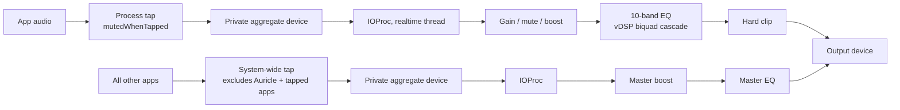

# Auricle

Per-app volume, EQ, boost, and output routing — a menu bar mixer for macOS.

Auricle sits in your menu bar and gives every app that plays audio its own volume slider, mute button, gain boost, 10-band equalizer, and output device. It is built entirely on public Core Audio process-tap APIs introduced in macOS 14.4, written in Swift and SwiftUI, with no third-party dependencies.

## Features

- **Per-app control** — independent volume, mute, boost (0 to +12 dB), and a 10-band graphic EQ for each app that plays audio.
- **Per-app output routing** — send one app to your headphones and another to your speakers.
- **System-wide master chain** — a Boost slider and 10-band EQ applied to everything at once.
- **Device & input control** — switch the default output device, adjust master volume/mute, and control input device gain and mute from the same popover.
- **EQ presets** — built-in presets (Flat, Bass Boost, Vocal, Loudness, …) plus your own saved presets.
- **Settings memory** — per-app volume, EQ, routing, and boost are remembered and restored when the app returns.
- **Live stereo meters** per app, so you can see who is making noise.
- **Native** — SwiftUI menu bar app, system materials, SF Symbols, zero dependencies.

## Requirements

- macOS **14.4** or later (the per-process tap API does not exist before 14.4).
- Apple Silicon or Intel (releases are universal binaries).

## Install

### Download

1. Grab `Auricle-<version>.dmg` from [Releases](../../releases), open it, and drag **Auricle** into **Applications** (a zip is also published if you prefer).
2. **The first launch will be blocked by Gatekeeper.** Auricle is ad-hoc signed and not notarized (there is no paid Developer ID behind this project), so double-clicking it the first time makes macOS say it "cannot be opened because Apple cannot check it for malicious software". This is expected — the instructions are also printed inside the DMG window:
   - Double-click Auricle once (let macOS refuse), then open **System Settings → Privacy & Security**, scroll down to the message about Auricle, click **Open Anyway** and confirm. Needed only once. (On macOS 13/14, right-click → **Open** → **Open** also works; macOS 15+ removed that shortcut.)
   - Terminal alternative:

     ```sh
     xattr -dr com.apple.quarantine /Applications/Auricle.app
     ```

   If you are not comfortable with either of these, build from source instead — locally built apps carry no quarantine flag and launch normally.

### Build from source

```sh
git clone https://github.com/cleoanka/auricle.git
cd auricle
./scripts/build-app.sh
```

The app lands in `dist/Auricle.app`. If SwiftPM fails to even compile `Package.swift` with linker errors about `PackageDescription` symbols, your active toolchain is the bare Command Line Tools; point it at full Xcode:

```sh
export DEVELOPER_DIR=/Applications/Xcode.app/Contents/Developer
```

(The build script does this automatically when Xcode.app is installed.)

## Permissions

On first use Auricle asks for **System Audio Recording** permission (System Settings → Privacy & Security → Screen & System Audio Recording). This is the macOS consent gate for Core Audio process taps — the mechanism Auricle uses to intercept each app's audio so it can re-play it at your chosen volume, EQ, and device. Without it, per-app control and meters cannot work; device switching and master volume still do.

Audio never leaves your machine. Auricle records nothing, stores no audio, and makes no network connections. The tapped samples exist only in memory for the milliseconds it takes to process and hand them back to the output device.

## How it works

For each controlled app, Auricle creates a Core Audio **process tap** (`AudioHardwareCreateProcessTap`) with `muteBehavior = .mutedWhenTapped`, which silences the app's direct output. The tap is attached to a private **aggregate device** that pairs it with the real output device (with drift compensation). An IOProc on the HAL realtime thread then replays the tapped audio — with ramped gain, a vDSP biquad-cascade 10-band EQ, boost, and a hard clip — into the output. The system-wide master chain works the same way with a global tap that excludes Auricle itself and every per-app-tapped process, so nothing is heard twice.



## Limitations

- **Ad-hoc signed, not notarized.** Every download hits Gatekeeper (see Install). TCC permission grants are keyed to the code signature, so updating to a new build may re-prompt for System Audio Recording.
- **macOS 14.4+ only** — process taps simply don't exist earlier.
- **Per-app audio bypasses the master chain by design.** An app with its own tap is routed directly (with its own boost/EQ) and excluded from the system-wide tap; the master Boost/EQ applies only to un-managed audio. This avoids double processing and feedback, but means master EQ does not stack on top of per-app EQ.
- Launch-at-login with an ad-hoc signature is best-effort; if the toggle fails, move Auricle to `/Applications` and try again.

## Hızlı Başlangıç

1. [Releases](../../releases) sayfasından `.dmg` dosyasını indirin, açın ve **Auricle**'ı **Applications** klasörüne sürükleyin.
2. İlk açılışta Gatekeeper engeller (imzalı ama noterli değil): Auricle'a bir kez çift tıklayın, macOS reddedince **Sistem Ayarları → Gizlilik ve Güvenlik**'e inin ve Auricle için **Yine de Aç**'a basın — bir kereye mahsus. (Alternatif: Terminal'den `xattr -dr com.apple.quarantine /Applications/Auricle.app`.)
3. Menü çubuğundaki dalga simgesine tıklayın; istendiğinde **Sistem Sesi Kaydı** iznini verin (ses cihazınızdan dışarı çıkmaz, hiçbir şey kaydedilmez).
4. Ses çalan her uygulama listede belirir: sesini kısın, susturun, ekolayzır açın veya başka bir çıkış aygıtına yönlendirin. Ayarlar hatırlanır.

## License

[MIT](LICENSE) © 2026 cleoanka
